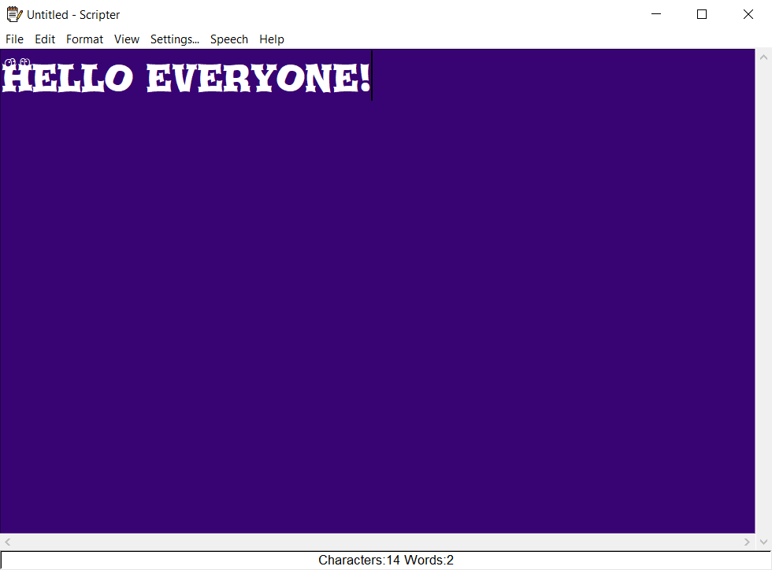

# Scripter
## Introduction
Scripter is a Tkinter based text editor similar to Notepad with added functionalities like text-to-speech, 
theme setting and more. It serves the basic features as well like open a text file, save file
and font and appearance as per user's need.
## Modules Used:
### pyttsx3
 * pyttsx3  is a text-to-speech conversion library in Python.   
 * Unlike alternative libraries, it works offline, and is compatible with both Python 2 and 3.
### Installation
 * pip install pyttsx3  
 * If you recieve errors such as No module named win32com.client,  
 * No module named win32, or No module named win32api, you will need to additionally install pypiwin32.
 ### Usage:
  import pyttsx3 
  engine = pyttsx3.init() 
  engine.say("I will speak this text") 
  engine.runAndWait() 
 ### tkinter
  The tkinter package (“Tk interface”) is the standard Python interface to the Tk GUI toolkit. 
  Both Tk and tkinter are available on most Unix platforms, as well as on Windows systems.  
  (Tk itself is not part of Python; it is maintained at ActiveState.)
 ### Installation
* pip install tk
 ### Usage:
 from tkinter import * 
 root=Tk() 
 root.geometry("700x550") 
 root.resizable(0,0) 
 root.mainloop()
 ### datatime
The datetime module supplies classes for manipulating dates and times.
### Usage
import datetime 
x = datetime.datetime.now()

